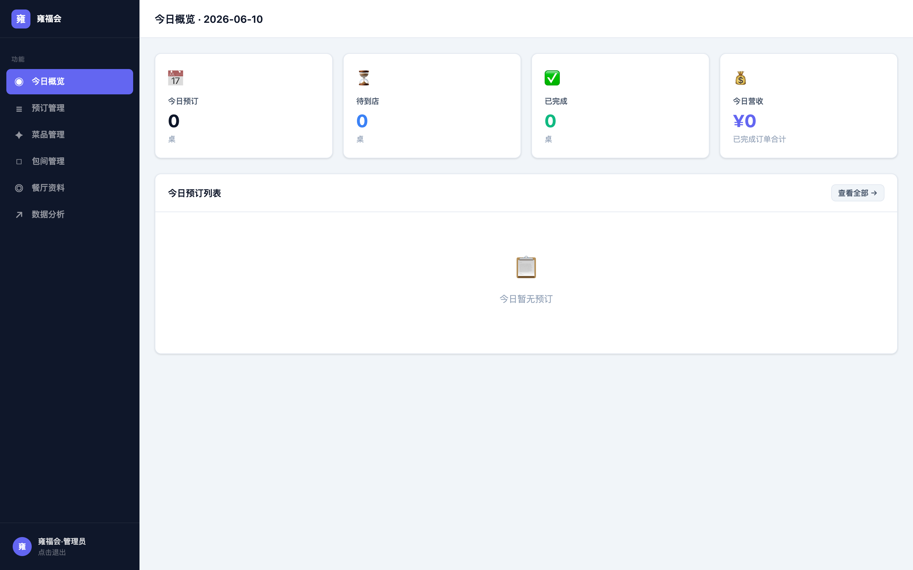
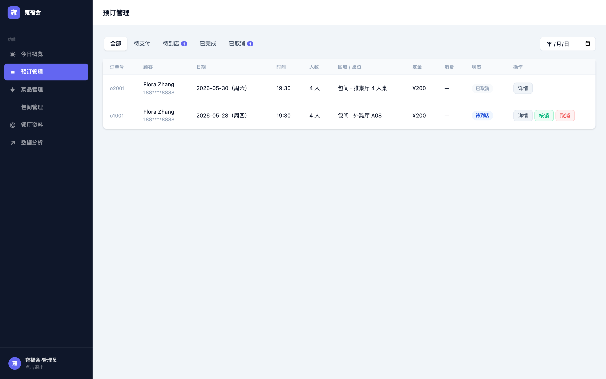
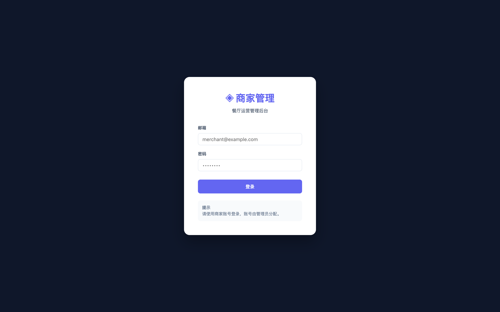

<h1 align="center">🏪 Premium Seat · Merchant Console</h1>

<p align="center"><b>每一桌，尽在掌握 · Every table, under control</b></p>
<p align="center"><i>The merchant-facing (B-side) console of the Premium Seat restaurant-reservation platform — where restaurants confirm bookings, check guests in, and manage tables & dishes</i></p>

<p align="center">
  <a href="./README.md"></a>
  <a href="./README.en.md"></a>
</p>

<p align="center">
  
  
  
  
</p>

---

## 🖥 Screenshots

<p align="center">
  
</p>
<p align="center">
  
  
</p>
<p align="center"><sub>Today's overview · Booking management · Merchant login (Supabase Auth, own-restaurant data only)</sub></p>

## 🌟 About

This is the **merchant console** of the three-sided **Premium Seat** platform. The moment a diner pays a deposit in the consumer app, the booking lands here in real time — merchants sign in to their own restaurant workspace, track today's bookings / arrivals / revenue on the overview dashboard, confirm orders, view guest details, check guests in with one click or cancel with rule-based refunds, and self-manage dishes (trending flags), private rooms (capacity / minimum spend) and restaurant profiles. Powered by Supabase Auth + Row-Level Security, every merchant account can only see and operate its own restaurant's data.

## ✨ Features

| Page | Highlights |
|------|-----------|
| 📊 Today's overview | Bookings / arrivals / completed / revenue cards + today's booking list |
| 📋 Booking management | Full order table with status & date filters, one-click check-in, rule-based cancel & refund |
| 🍽 Dish management | CRUD + trending toggle |
| 🚪 Room management | CRUD with capacity & minimum spend |
| 🏛 Restaurant profile | Name / cuisine / address / hours / price / intro |
| 📈 Analytics | 7/30/90-day booking trends, status distribution, peak-hour Top 5 |

## 🚀 Quick start

```bash
npm install
cp .env.example .env      # fill in your Supabase URL & key
npm run dev               # → http://localhost:5174
```

Demo accounts: `merchant@yongfuhui.com / Merchant@2024` · `merchant@yuzhilan.com / Merchant@2024`
Accounts are provisioned via `create_merchant.mjs` and bound to restaurants through the `merchants` table.

## 🔒 Authorization model

- Merchants sign in via **Supabase Auth** (email + password)
- **Row-Level Security**: the `merchants` table binds `auth.users ↔ restaurant`; each merchant can only read/write its own restaurant's profile, dishes, rooms and orders
- Production uses the anon key + RLS; service_role is for local development only

## 🛠 Tech stack

React 18 · Vite 5 · React Router v6 · Supabase (PostgreSQL + PostgREST + Auth) · pure-CSS admin styling (no UI framework)

## 🔗 Sibling repositories

| Repo | Role |
|------|------|
| [premium-seat-booking-app](https://github.com/QingMXL/premium-seat-booking-app) | Consumer app (C-side): discover, floor-plan seat picking, deposit lock |
| **premium-seat-merchant-app** (this repo) | Merchant console (B-side) |
| [Premium-Seat---Admin](https://github.com/QingMXL/Premium-Seat---Admin) | Platform console (operations): restaurants, merchants, orders & users |

## 📄 License

MIT © 2026
